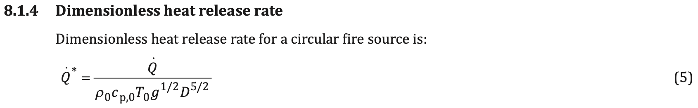
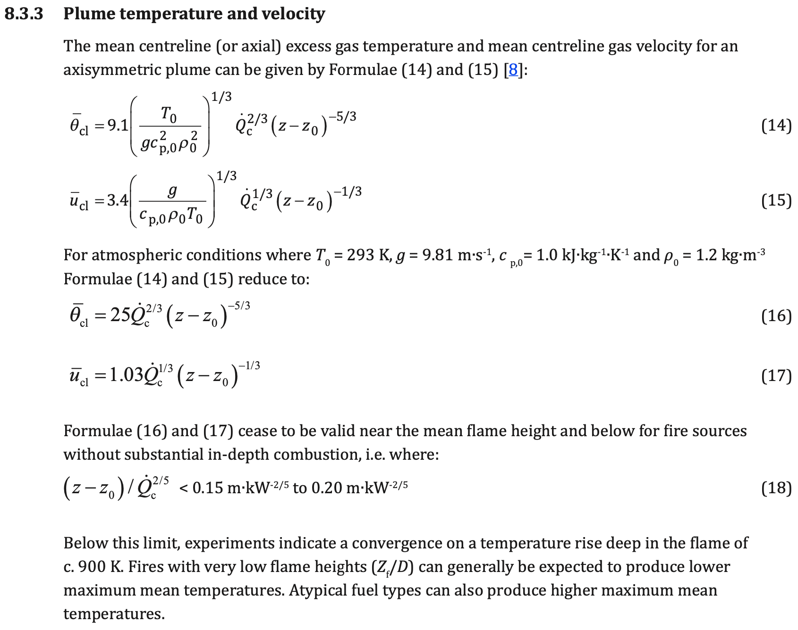
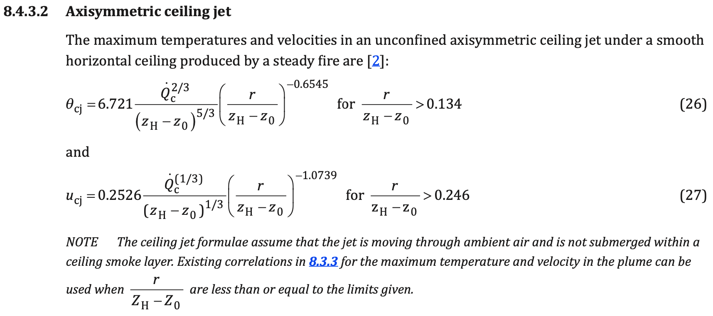

# App information

Module code: 0111

Module name: PD 7974 heat detection element activation

# Quality management

| Date       | Author | Checker  | Remarks                                                      |
| ---------- | ------ | -------- | ------------------------------------------------------------ |
| 2020/02/06 | Ian F. | Chris M. | Compared against with an independently developed spreadsheet |
| 2020/02/07 | Ian F. | Danny H. | Compared against with an independently developed spreadsheet |

#Background

Referenced clauses of PD 7974-1:2019 as below.

