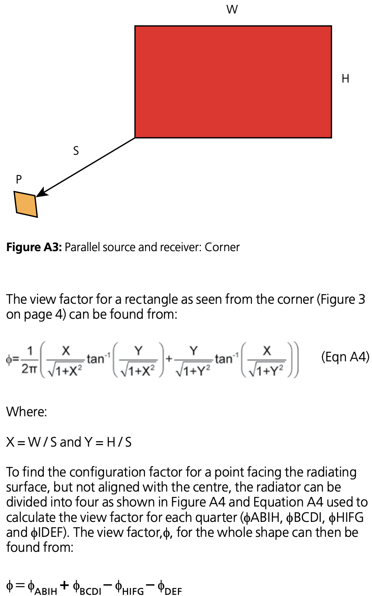

## App information

Module code: 0401

Module name: BR 187 parallel oriented rectangle emitter and receiver

## Quality management

| Date       | Author | Checker | Remarks                                    |
| ---------- | ------ | ------- | ------------------------------------------ |
| 2020/03/11 | Ian F. | Alex T. | Checked referenced functions in `fsetools` |

# Background

