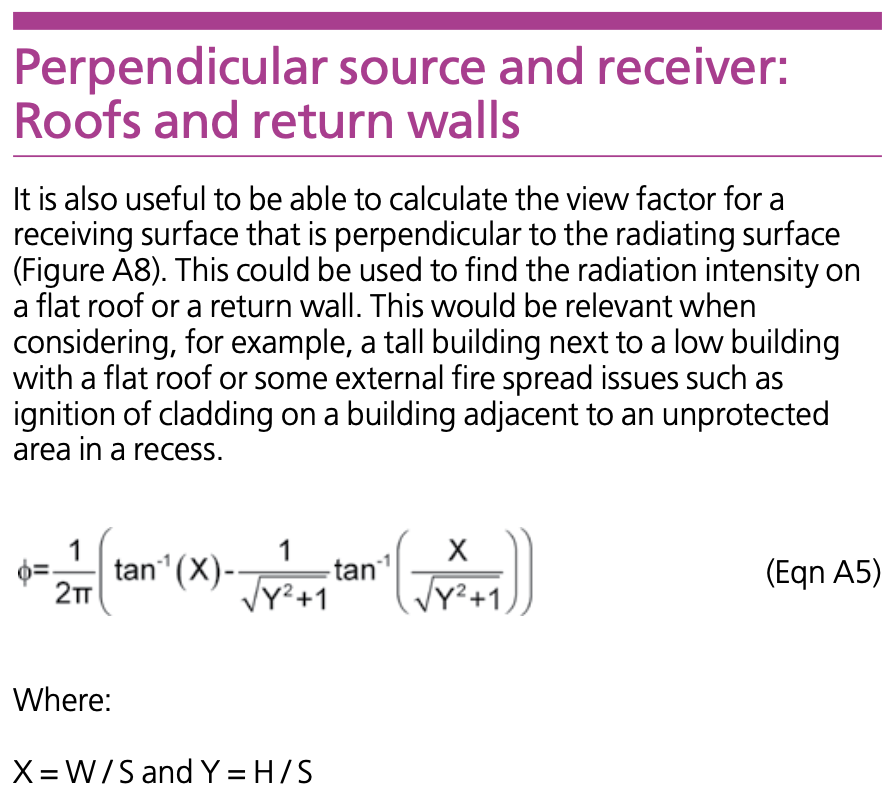
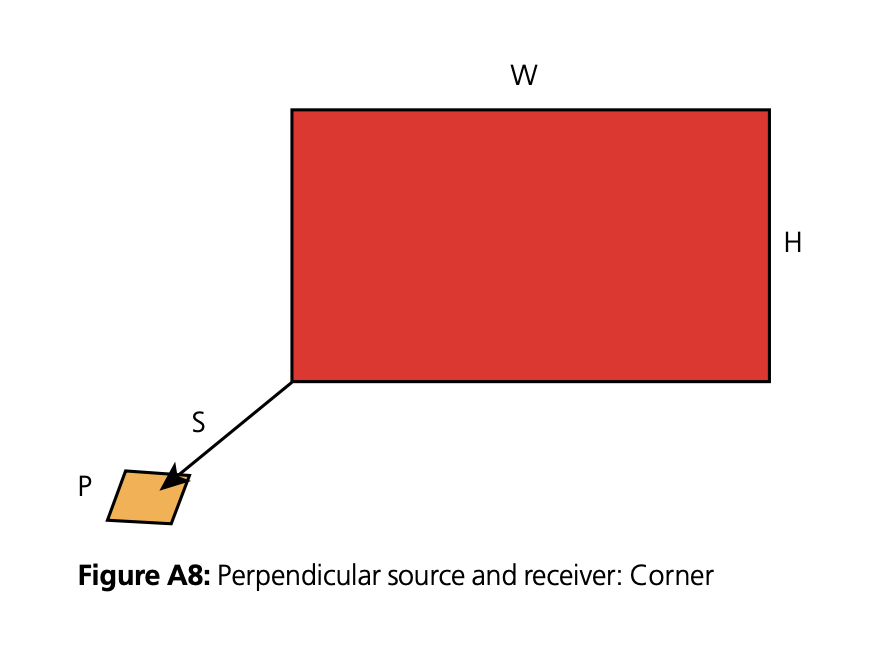

# App information

Module code: 0402

Module name: BR 187 perpendicular oriented rectangle emitter and receiver

# Quality management

| Date       | Author | Checker | Remarks |
| ---------- | ------ | ------- | ------- |
| 30/03/2020 | Ian F. | Ian F.  | Initial |

# Background

Referenced BR 187 clauses are shown below.

