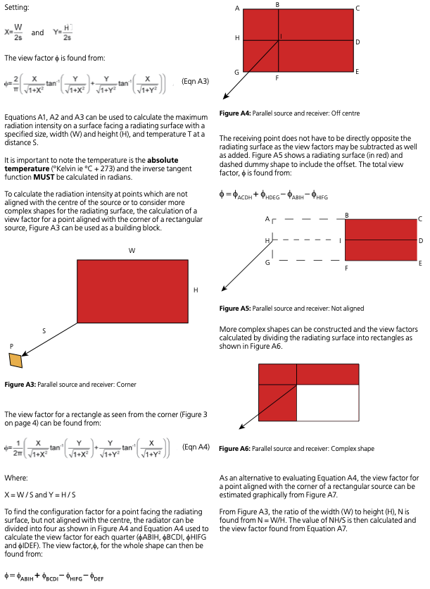

# App information

Module code: 0404

Module name: BR 187 perpendicular oriented rectangle emitter and eccentric receiver

# Quality management

| Date       | Author | Reviewer  | Remarks                                                      |
| ---------- | ------ | --------- | ------------------------------------------------------------ |
| 2020/03/30 | I. Fu  | Z. Askif  | Initial                                                      |
| 2020/07/31 | I. Fu  | D. Hopkin | Compared numerical results from an independently developed tool |

# Background

Referenced BR 187 clauses shown below.

