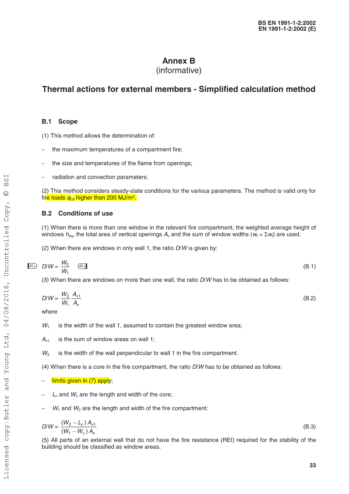
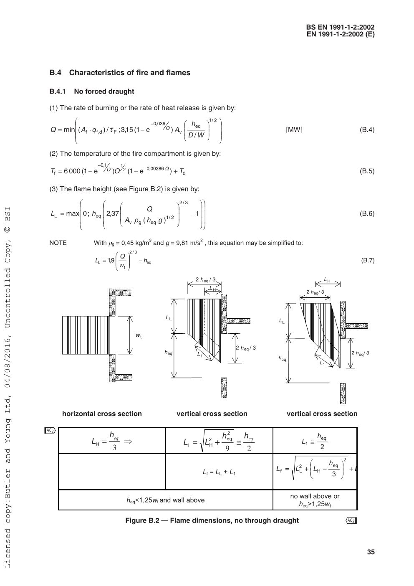
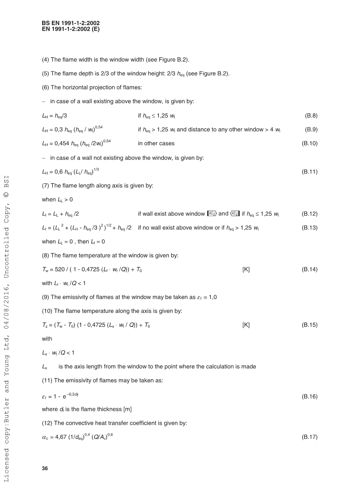
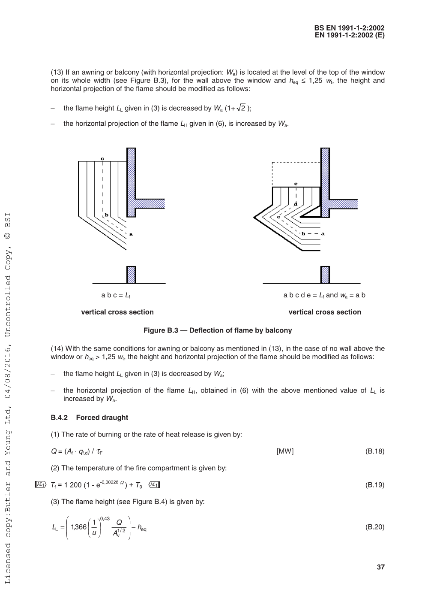
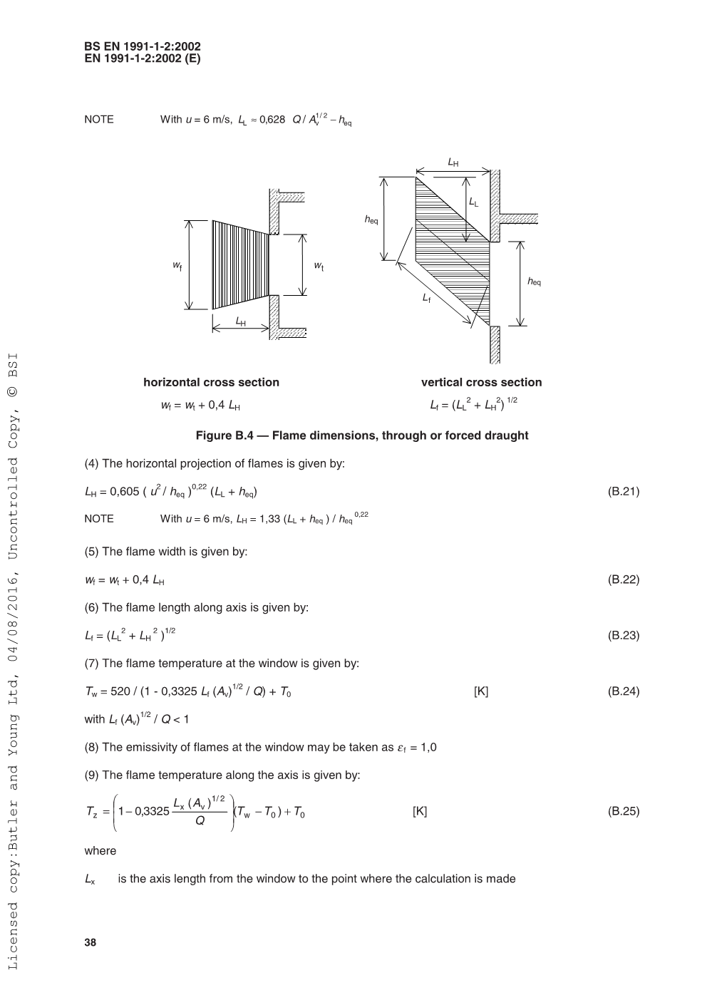
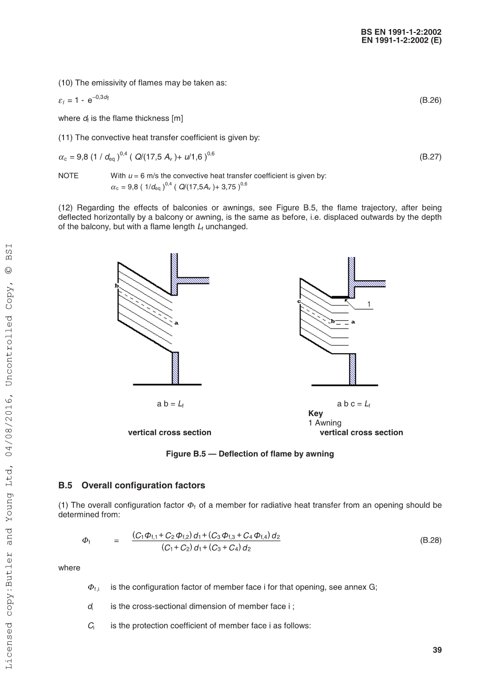
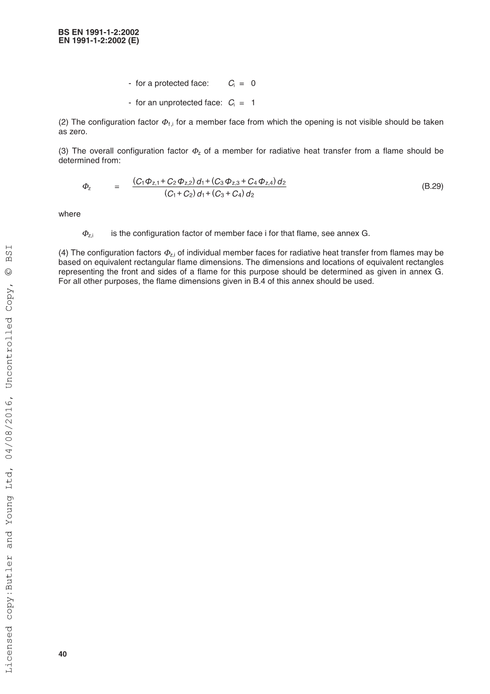

# App information

Module code: 0411

Module name: BS EN 1991-1-2 Thermal actions for external members - Simplified calculation method

# Quality management

| Date       | Author | Checker | Remarks |
| ---------- | ------ | ------- | ------- |
| 2020/08/16 | Ian F. | Ian F.  | Initial |

# Background

Calculation in accordance with Annex B, BS EN 1991-1-2:2002 

